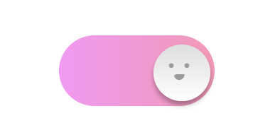

# Frontend Mentor - QR code component solution

Este foi um exercício para melhorar meus estudos em HTML e CSS. 

## Índice

- [Overview](#overview)
  - [Print do Projeto](#print-do-projeto)
  - [Links](#links)
- [Meu processo](#meu-processo)
  - [Construído com](#construído-com)
  - [O que aprendi](#o-que-aprendi)
  - [Desenvolvimento contínuo](#desenvolvimento-contínuo)
- [Autor](#autor)
- [Agradecimento](#agradecimento)

## Overview

### Print do projeto

 


### Links

- URL da solução: [Repositório](https://github.com/maiarasteffen/input-animado)

## Meu Processo

### Construído com

- Marcação HTML5 semântica
- Propriedades personalizadas do CSS
- Flexbox
- Grade CSS

Códigos utilizados:

```html
<div class="check">
    <input id="check" type="checkbox">
    <label for="check"></label>
</div>
```
```css
:root {font-size: 100px;}

body {
    min-height: 100vh;
    display: grid;
    place-items: center;
}

.check {
    position: relative;
    background: linear-gradient(90deg,#f19af3, #f099b5);
    line-height: 0;
    perspective: 400px;
}

.check input[type="checkbox"],
.check label,
.check label::before,
.check label::after,
.check {
    appearance: none;
    display: inline-block;
    border-radius: 1rem;
    border: 0;
    transition: .35s ease-in-out;
    box-sizing: border-box;
    cursor: pointer;
}

.check label {
    width: 2.2rem;
    height: 1rem;
    background: #d7d7d7;
    overflow: hidden;
}

.check input[type="checkbox"] {
    position: absolute;
    z-index: 1;
    width: .8rem;
    height: .8rem;
    top: .1rem;
    left: .1rem;
    background: linear-gradient(#dedede, #ffffff);
    box-shadow: 0 6px 7px rgba(0, 0, 0, 0.3);
    outline: none;
}

.check input[type="checkbox"]:checked {
    left: 1.3rem;
}

.check input[type="checkbox"]:checked + label {
    background: transparent;
}

.check label::before,
.check label::after {
    content: ".  .";
    position: absolute;
    overflow: hidden;
    left: .3rem;
    top: .4rem;
    height: 3rem;
    letter-spacing: -.04rem;
    color: #9b9b9b;
    font-family: 'Times New Roman', serif;
    z-index: 2;
    font-size: .6rem;
    border-radius: 0 0 -.5rem;
    backface-visibility: hidden;
}

.check label::after {
    content: "•";
    top: .7rem;
    left: .43rem;
    height: .05rem;
    width: .35rem;
    font-size: .35rem;
    transform-origin:0 0 -.4rem;
}

.check input[type="checkbox"]:checked + label::before,
.check input[type="checkbox"]:checked + label::after {
    left: 1.52rem;
    top: .24rem;
    line-height: .05rem;
    transform: rotateY(360deg);
}

.check input[type="checkbox"]:checked + label::after {
    height: .16rem;
    top: .55rem;
    left: 1.6rem;
    font-size: .6rem;
    line-height: 0;
}

```

### Desenvolvimento contínuo

Esse foi um dos exemplos que venho fazendo para estudos e aperfeiçoamentos. Outras demostrações como essa são: relógio, teclado virtual, loading..., links de redes sociais.

## Autor

- LinkedIn - [@maiarasteffen](https://www.linkedin.com/in/maiara-steffen/)
- Instagram - [@maiara_steffen](https://www.instagram.com/maiara_steffen/)